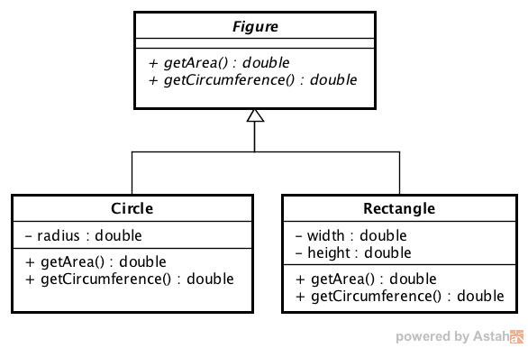

# Lerneinheit 08

Im Package [ch.fhnw.oop1.le](./src/ch/fhnw/oop1/le) finden Sie Code Beispiele aus den Videos.

# Arbeitsblatt (AB)

## Abstrakte Klassen

Mit diesem Arbeitsblatt schauen wir uns konkret das Figuren-Beispiel an. Wir werden folgende Klassen definieren: Die Klasse `Figure` ist eine abstrakte Oberklasse der beiden konkreten Klassen `Circle` und `Rectangle`. Die Methoden `getArea` und `getCircumference` sind als abstrakte Methoden deklariert, diese müssen also in den abgeleiteten konkreten Klassen implementiert werden.



Wir gehen dabei wie folgt vor:

<ol type="a">
  <li>Erstellen der abstrakten Oberklasse Figure</li>
  <li>Schreiben der Klasse Rectangle</li>
  <li>Schreiben der Klasse Circle</li>
  <li>Verwenden der Klassen in einer Startklasse Geometry</li>
</ol>

Alle Klassen kommen ins Package [ch.fhnw.oop1.ab](./src/ch/fhnw/oop1/ab).

### a) Erstellen der abstrakten Klasse Figure

Schreiben Sie eine abstrakte Klasse `Figure`, welche als abstrakte Methoden die öffentlichen
(`public`) Methoden `getArea()` und `getCircumference()` hat. Beide Methoden sollen den berechneten Wert als Gleitkommazahl (`double`) zurückgeben können.
 
### b) Erstellen der Klasse Rectangle
Die Klasse `Rectangle` hat die zwei Attribute `width` und `height` vom Typ `double`.

* Erstellen Sie eine neue Klasse `Rectangle`, welche von der Klasse `Figure` erbt.

* Fügen Sie nun die beiden Attribute `width` und `height` vom Typ `double` hinzu, und schreiben 
Sie auch noch die Getter- und Setter-Methoden.

* Fügen Sie noch einen Konstruktor hinzu, mit welchem die Attribute `width` und `height` initialisiert werden können.

* Implementieren Sie die beiden Methoden, welche die Fläche und den Umfang berechnen. 
 
### c) Klasse Circle
Bei der Klasse `Circle` brauchen wir nur eine Variable, welche gesetzt wird, nämlich den Radius. 

* Erzeugen sie analog zu Aufgabe b) eine Klasse `Circle`, welche von der Klasse `Figure` abgeleitet ist.

* Fügen Sie das Attribut `radius` vom Typ double hinzu, und definieren Sie für dieses Attribut die Getter- und Setter-Methode. 

* Definieren Sie für die Klasse `Circle` einen Konstruktor, mit dem der Radius gesetzt werden kann.

* Implementieren Sie die beiden Methoden, welche die Fläche und den Umfang berechnen. Für die Berechnung dieser Werte können Sie die Konstante `Math.PI` verwenden.

### d) Startklasse Geometry
Nun wollen wir überprüfen, ob unsere Klassen auch so funktionieren, wie wir uns das vorstellen. Dazu haben wir die Klasse `Geometry` bereitgestellt.
Die Methoden der Klassen sind auskommentiert, weil Sie nicht kompilieren bevor Sie die Aufgaben a) - c) gelöst haben. Entfernen Sie die Kommmentarzeilen auf Zeile 10 und 65.
Das Programm kann sich wie folgt mit dem Nutzer unterhalten:

```
Was möchten Sie erstellen? (Rechteck, Kreis, Nichts)
Kreis
Radius?:
4.2
Fläche: 55.41769440932395
Umfang: 26.389378290154262
Was möchten Sie erstellen? (Rechteck, Kreis, Nichts)
Rechteck
Breite?:
2
Höhe?:
3
Fläche: 6.0
Umfang: 10.0
Was möchten Sie erstellen? (Rechteck, Kreis, Nichts)
Nichts
Bye bye
```

*	Verwenden Sie die vorgegebene `Geometry` Klasse um mit ihren Figuren zu experimentieren.


&nbsp;

# Übung (UB)

## Stack
In dieser Übung implementieren Sie zwei Varianten einer `Stack` Datenstruktur zur Verwaltung von Objekten.

### 1. Interface definieren
Definieren Sie in einem ersten Schritt das Interface `ch.fhnw.oop1.ub.stack.Stack`. Es soll folgende Methoden anbieten:

`boolean isEmpty()` testet, ob der Stack leer ist.

`int getSize()`	gibt die Anzahl der aktuell im Stack enthaltenen Elemente zurück.

`void clear()` löscht alle Elemente vom Stack.

`Object peek()` gibt das oberste Element vom Stack zurück ohne dieses zu entfernen. Diese Methode kann nur aufgerufen werden falls der Stack nicht leer ist. Falls der Stack leer ist, dann ist das Verhalten dieser Methode nicht definiert.

`Object pop()` entfernt das oberste Element vom Stack und gibt dieses zurück. Diese Methode kann nur aufgerufen werden falls der Stack nicht leer ist. Falls der Stack leer ist, dann ist das Verhalten dieser Methode nicht definiert.

`void push(Object elem)` legt ein Element auf dem Stack ab.

`void pushAll(Object[] elems)` legt alle Elemente auf dem Stack ab.

`boolean equals(Object x)` vergleicht das Argument `x` mit dem Stack, auf dem die Methode aufgerufen wird. Diese Methode gibt `true` zurück, falls das Argument ebenfalls ein `Stack` ist und falls die Grösse gleich ist und falls die Elemente auf dem Stack gleich sind, d.h. falls für zwei Elemente `e1` und `e2` an entsprechender Position auf dem Stack gilt, dass falls `e1==null` ist, dass dann auch `e2==null` ist, oder falls `e1 != null` ist, dass dann `e1.equals(e2)` gilt.

### 2) Interface implementieren
Implementieren Sie das Interface `Stack` auf zwei unterschiedliche Arten.

a) Basierend auf einem Array. Wenn die Kapazitätsgrenze erreicht wird, muss der darunterliegende Array automatisch vergrössert werden.

b) Als lineare Liste, d.h. eine Liste von Knoten vom Typ
```
class Node {
    Object element;
    Node next;
}
```

Das `Stack`-Interface soll im Package [ch.fhnw.oop1.ub.stack](./src/ch/fhnw/oop1/ub/stack) erstellt werden. Für die Beiden Implementierungen sind die Packages [ch.fhnw.oop1.ub.stack.impl.array](./src/ch/fhnw/oop1/ub/stack/impl/array) und [ch.fhnw.oop1.ub.stack.impl.node](./src/ch/fhnw/oop1/ub/stack/impl/node) vorgesehen. 

### 3) Klassen testen
Die Klasse [ch.fhnw.oop1.ub.stack.test.AbstractStackTest](./src/ch/fhnw/oop1/ub/stack/test/AbstractStackTest.java) enthält Tests um `Stack` Implementierungen zu testen. Die Tests sind alle gegen das `Stack` Interface programmiert und nicht etwa gegen eine konkrete Implementierung. Somit ist diese Testklasse in der Lage beide Ihrer `Stack` Implementierungen testen. Dazu müssen Sie zwei Subklassen von `AbstractStackTest` definieren, die jeweils eine Instanz der konkreten `Stack` Implementierung erzeugt. Finden Sie heraus welche Methode überschrieben werden muss.
Der Code der Klasse `AbstractStackTest` ist auskommentiert, weil die Klasse nicht kompiliert, solange Ihr `Stack` interface nicht existiert.

### 4) Abstrakte Superklasse einbauen
Untersuchen Sie Ihre beiden `Stack`-Implementierungen. Gibt es Funktionalität die nur einmal in einer abstrakten Superklasse implementiert werden könnte? Definieren Sie die Klasse `AbstractStack` und nutzen Sie diese um die Gemeinsamkeiten nur einmal implementieren zu müssen.
